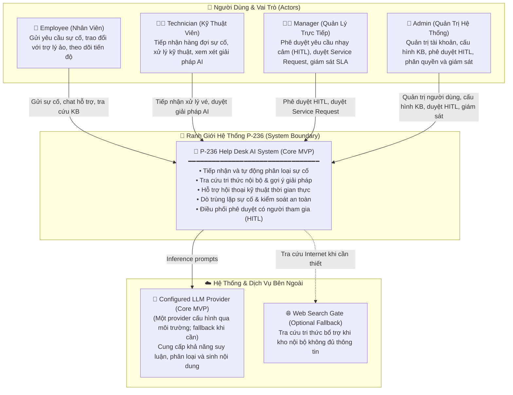

# C1 — System Context Diagram (Mức 1: Bối Cảnh Hệ Thống)

> **Tài liệu bổ sung:** Sơ đồ này làm rõ một phần của kiến trúc MVP P-236. Nội dung có thể được điều chỉnh trong quá trình tiếp tục tích hợp và không đại diện cho kiến trúc production cuối cùng.
>
> `Core MVP` biểu thị thành phần thuộc phạm vi MVP, không mặc định rằng thành phần đã hoàn thiện hoặc được xác minh end-to-end.

---

## 1. Sơ Đồ C1: System Context

Sơ đồ thể hiện bức tranh toàn cảnh về người dùng (4 vai trò riêng biệt), ranh giới hệ thống **P-236 Help Desk AI**, và các hệ thống bên ngoài tương tác.

---

## 2. Bảng Mô Tả Các Thực Thể

| Thực Thể | Loại | Trạng Thái | Trách Nhiệm Chính |
| :--- | :--- | :---: | :--- |
| **Employee** | Actor (Người dùng) | `Core MVP` | Gửi yêu cầu hỗ trợ sự cố CNTT, trao đổi với trợ lý ảo, nhận giải pháp tự động hoặc theo dõi tiến độ xử lý. |
| **Technician** | Actor (Người dùng) | `Core MVP` | Tiếp nhận vé từ hàng đợi, thực hiện khắc phục kỹ thuật chuyên sâu, xem xét và chỉnh sửa giải pháp do AI đề xuất. |
| **Manager** | Actor (Người dùng) | `Core MVP` | Phê duyệt các hành động có rủi ro cao qua bảng điều khiển **HITL**, duyệt yêu cầu cấp phát dịch vụ và giám sát SLA nhóm. |
| **Admin** | Actor (Người dùng) | `Core MVP` | Quản trị tài khoản, cấu hình kho tri thức KB, phê duyệt HITL khi cần thiết, phân quyền người dùng và giám sát toàn diện hệ thống. |
| **P-236 System** | Hệ thống phần mềm | `Core MVP` | Cổng tiếp nhận thông minh, điều phối đồ thị tác nhân LangGraph, truy xuất tri thức nội bộ và bảo vệ an toàn đa tầng. |
| **Configured LLM Provider** | Dịch vụ ngoài | `Core MVP` | Xử lý ngôn ngữ tự nhiên: một provider được chọn qua cấu hình môi trường; fallback được sử dụng khi được cấu hình. |
| **Web Search Gate** | Dịch vụ ngoài | `In Progress` | Cơ chế tra cứu cứu cánh ra Internet khi kho tri thức nội bộ không đủ thông tin để trả lời. |
