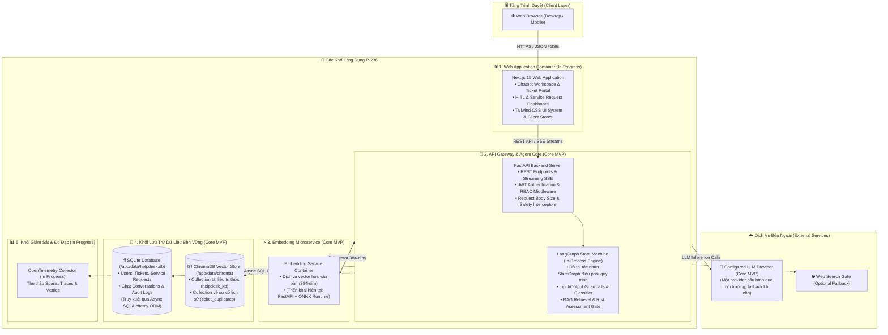

# C2 — Container Architecture Diagram (Mức 2: Các Khối Ứng Dụng & Hạ Tầng)

> **Tài liệu bổ sung:** Sơ đồ này làm rõ một phần của kiến trúc MVP P-236. Nội dung có thể được điều chỉnh trong quá trình tiếp tục tích hợp và không đại diện cho kiến trúc production cuối cùng.
>
> `Core MVP` biểu thị thành phần thuộc phạm vi MVP, không mặc định rằng thành phần đã hoàn thiện hoặc được xác minh end-to-end.
>
> ONNX Runtime là phương án triển khai hiện tại của Embedding Service, không phải ràng buộc kiến trúc và có thể được thay thế bằng model hoặc provider tương thích.

---

## 1. Sơ Đồ C2: Container Diagram

Sơ đồ phân rã các khối ứng dụng (Containers / Executable Units), kho lưu trữ dữ liệu và các giao thức kết nối trong hệ thống **P-236 MVP**.

---

## 2. Bảng Mô Tả Các Container & Khối Dữ Liệu

| Khối Thành Phần | Công Nghệ / Triển Khai Hiện Tại | Trạng Thái | Vai Trò & Giao Thức Kết Nối |
| :--- | :--- | :---: | :--- |
| **Web Application** | Next.js 15 (React 19, TypeScript) | `In Progress` | Cung cấp giao diện người dùng cho Nhân viên, Kỹ thuật viên, Quản lý và Quản trị viên. Giao tiếp với Backend qua HTTPS REST API và Server-Sent Events (SSE). |
| **API & Agent Core** | FastAPI (Python 3.11, Uvicorn) | `Core MVP` | Máy chủ xử lý nghiệp vụ chính, tiếp nhận API, xác thực quyền hạn và chạy đồ thị tác nhân **LangGraph** (chạy in-process bên trong FastAPI). |
| **Embedding Service** | Triển khai hiện tại: FastAPI + ONNX Runtime | `Core MVP` | Microservice độc lập sinh vector 384 chiều cho câu hỏi và tài liệu tri thức, tách xử lý embedding khỏi backend; có thể thay đổi engine linh hoạt. |
| **Relational Database** | SQLite (`/app/data/helpdesk.db`) | `Core MVP` | Lưu trữ dữ liệu quan hệ có cấu trúc: tài khoản, vé sự cố, yêu cầu dịch vụ, lịch sử hội thoại và bản ghi kiểm toán (*Audit Logs*). |
| **Vector Store** | ChromaDB (`/app/data/chroma`) | `Core MVP` | Lưu trữ và tìm kiếm vector ngữ nghĩa tương đồng cho kho tri thức KB và dò vé trùng lặp. |
| **PostgreSQL / pgvector**| PostgreSQL | `Future Extension` | Mở rộng khả năng lưu trữ và truy vấn vector quy mô lớn khi tải tăng cao. |
| **Observability Stack** | OpenTelemetry | `In Progress` | Thu thập metrics và phân tích luồng thực thi tác nhân AI. |
