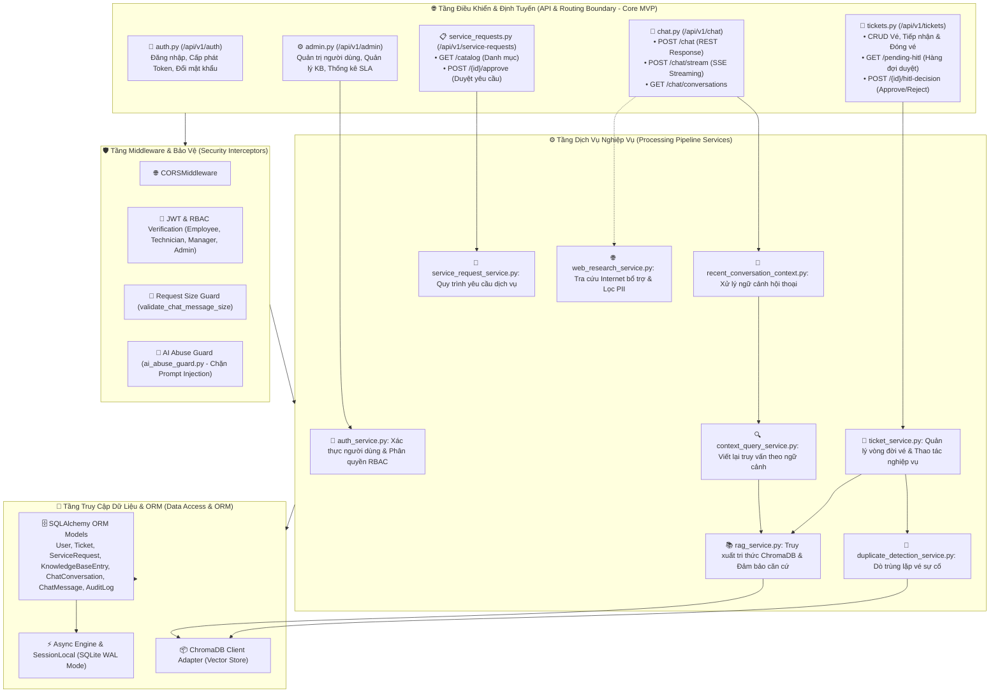

# C3A — Backend Component Diagram (Mức 3A: Các Thành Phần Backend)

> **Tài liệu bổ sung:** Sơ đồ này làm rõ một phần của kiến trúc MVP P-236. Nội dung có thể được điều chỉnh trong quá trình tiếp tục tích hợp và không đại diện cho kiến trúc production cuối cùng.
>
> `Core MVP` biểu thị thành phần thuộc phạm vi MVP, không mặc định rằng thành phần đã hoàn thiện hoặc được xác minh end-to-end.

---

## 1. Sơ Đồ C3A: Backend Component Architecture

Sơ đồ thể hiện cấu trúc phân tầng bên trong máy chủ **FastAPI Backend**, bao gồm các API Routers, Middleware, Business Services và tầng Data Access & ORM được mô tả theo cấu trúc mã nguồn MVP.

---

## 2. Bảng Mô Tả Các Thành Phần Backend

| Thành Phần / Module | Phân Tầng | Trạng Thái | Vai Trò & Endpoint Thực Tế |
| :--- | :--- | :---: | :--- |
| **Auth Router (`auth.py`)** | API Layer | `Core MVP` | Xử lý đăng nhập (`POST /api/v1/auth/login`), cấp phát JWT token và kiểm tra phân quyền. |
| **Chat Router (`chat.py`)** | API Layer | `Core MVP` | Cung cấp phản hồi REST (`POST /api/v1/chat`), phản hồi streaming (`POST /api/v1/chat/stream`) và quản lý cuộc trò chuyện (`GET /api/v1/chat/conversations`). |
| **Ticket Router (`tickets.py`)** | API Layer | `Core MVP` | Quản lý vé sự cố, hàng đợi HITL (`GET /api/v1/tickets/pending-hitl`) và tiếp nhận quyết định duyệt (`POST /api/v1/tickets/{id}/hitl-decision`). |
| **Service Request Router (`service_requests.py`)** | API Layer | `Core MVP` | Cung cấp danh mục dịch vụ (`GET /catalog`) và duyệt yêu cầu (`POST /{id}/approve`, `POST /{id}/reject`). |
| **Security Interceptors** | Middleware | `Core MVP` | Lọc kích thước payload, phát hiện tấn công prompt injection qua `ai_abuse_guard.py` và kiểm tra JWT/RBAC. |
| **RAG Service (`rag_service.py`)** | Service Layer | `Core MVP` | Gọi Embedding Service sinh vector, truy vấn tài liệu trong ChromaDB và trích xuất runbook xử lý. |
| **Duplicate Detection Service** | Service Layer | `Core MVP` | So sánh vector sự cố mới với các sự cố lịch sử trong collection `ticket_duplicates`. |
| **Data Access & ORM** | Data Access | `Core MVP` | Sử dụng Async SQLAlchemy để thao tác dữ liệu an toàn trên SQLite (`/app/data/helpdesk.db`). |
