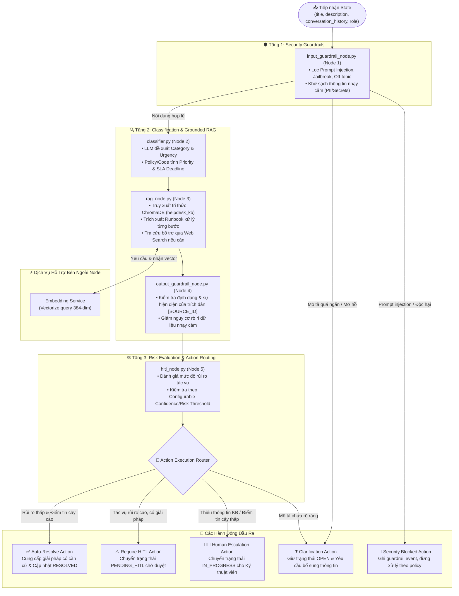

# C3B — Agent Components Diagram (Mức 3B: Đồ Thị Tác Nhân LangGraph)

> **Tài liệu bổ sung:** Sơ đồ này làm rõ một phần của kiến trúc MVP P-236. Nội dung có thể được điều chỉnh trong quá trình tiếp tục tích hợp và không đại diện cho kiến trúc production cuối cùng.
>
> `Core MVP` biểu thị thành phần thuộc phạm vi MVP, không mặc định rằng thành phần đã hoàn thiện hoặc được xác minh end-to-end.

---

## 1. Sơ Đồ C3B: LangGraph Agent Architecture

Sơ đồ thể hiện quy trình điều phối tác vụ qua đồ thị trạng thái **LangGraph StateGraph** (`src/agents/graph.py`), xử lý tuần tự từ tiền xử lý an toàn, phân loại, tìm kiếm tri thức đến đánh giá rủi ro và ra quyết định hành động.



---

## 2. Nguyên Tắc Điều Phối Quyết Định (Decision Principles)

Quy trình quyết định trong đồ thị tác nhân được thiết kế theo nguyên tắc:

```text
LLM Proposes (Đề xuất) → HITL / Safety Policy Evaluates (Đánh giá) → Application Code Updates State (Thực thi)
```

1. **Kiểm soát hành động nhạy cảm:** Mọi thao tác can thiệp hệ thống, thay đổi quyền hạn hoặc sự cố mức ưu tiên cao được đánh giá tại `hitl_node.py` để quyết định chuyển con người duyệt (`PENDING_HITL`).
2. **Ngưỡng rủi ro có thể cấu hình (*Configurable Thresholds*):** Ngưỡng phân loại giữa Auto-Resolve và HITL được điều chỉnh linh hoạt theo chính sách an toàn của tổ chức.
3. **Ưu tiên căn cứ bằng chứng (*Evidence Grounding*):** Hệ thống ưu tiên câu trả lời có nguồn trích dẫn từ tài liệu tri thức nội bộ; nếu thiếu bằng chứng, hệ thống chuyển sang Kỹ thuật viên xử lý thủ công (`IN_PROGRESS`); nếu mô tả chưa rõ ràng, giữ `OPEN` và yêu cầu bổ sung thông tin (*Clarification*).

---

## 3. Bảng Mô Tả Các Node Xử Lý Trong Graph

| Tên Node | File Triển Khai | Trạng Thái | Vai Trò Chính |
| :--- | :--- | :---: | :--- |
| **Input Guardrail** | `input_guardrail_node.py` | `Core MVP` | Kiểm tra tính an toàn của câu hỏi đầu vào, phát hiện prompt injection và lọc dữ liệu nhạy cảm. |
| **Classifier** | `classifier.py` | `Core MVP` | LLM đề xuất danh mục và độ khẩn cấp, mã nguồn tính toán độ ưu tiên và thời hạn xử lý SLA. |
| **RAG & Runbook** | `rag_node.py` | `Core MVP` | Tìm kiếm tài liệu tri thức phù hợp từ ChromaDB qua Embedding Service, trích xuất runbook xử lý từng bước. |
| **Output Guardrail** | `output_guardrail_node.py` | `Core MVP` | Rà soát câu trả lời, kiểm tra định dạng và sự hiện diện của trích dẫn `[SOURCE_ID]`, giảm nguy cơ rò rỉ dữ liệu nhạy cảm. |
| **HITL Check Node** | `hitl_node.py` | `Core MVP` | Đánh giá điểm tin cậy và rủi ro tác vụ để quyết định tự động giải quyết hay chuyển vào hàng đợi duyệt của con người. |
