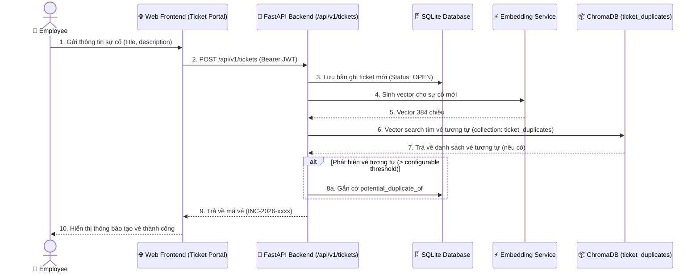
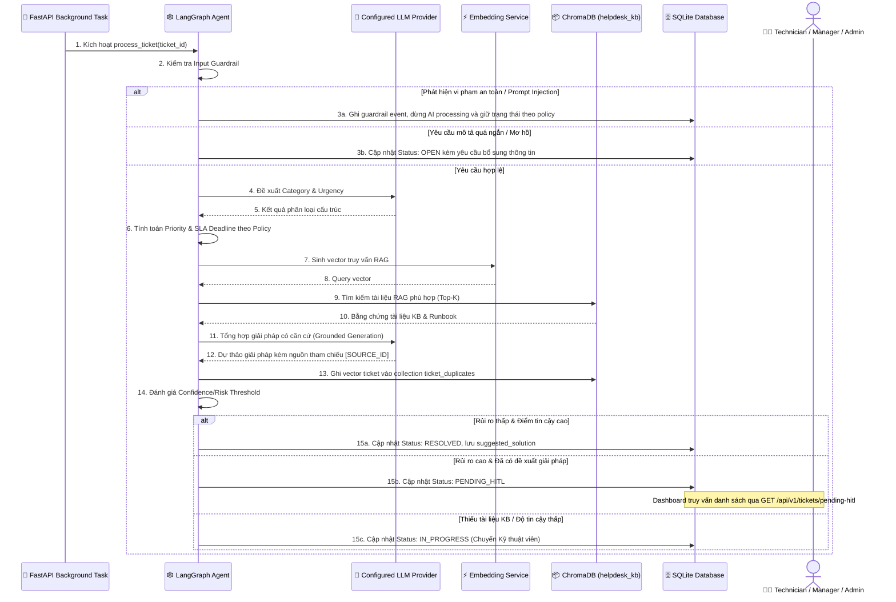

# D1 — Ticket Data Flow (Luồng Dữ Liệu Xử Lý Sự Cố)

> **Tài liệu bổ sung:** Sơ đồ này làm rõ một phần của kiến trúc MVP P-236. Nội dung có thể được điều chỉnh trong quá trình tiếp tục tích hợp và không đại diện cho kiến trúc production cuối cùng.
>
> `Core MVP` biểu thị thành phần thuộc phạm vi MVP, không mặc định rằng thành phần đã hoàn thiện hoặc được xác minh end-to-end.

---

## 1. Giai Đoạn 1: Tiếp Nhận Vé & Dò Trùng Lặp (Ticket Creation & Duplicate Check)

Sơ đồ thể hiện quy trình khi người dùng tạo vé sự cố mới từ giao diện Web Portal, lưu trữ dữ liệu vào SQLite và kiểm tra trùng lặp qua ChromaDB.

---

## 2. Giai Đoạn 2: Xử Lý Phân Loại & Đề Xuất Giải Pháp (AI Triage Processing)

Sơ đồ quy trình xử lý nền của tác nhân **LangGraph Agent** đối với vé sự cố vừa tạo.

---

## 3. Quy Ước Vòng Đời Chuyển Trạng Thái Vé

Hệ thống quản lý trạng thái vé theo các chuyển dịch hợp lệ đầy đủ (Non-linear state transitions):
- **`OPEN → RESOLVED`:** Tự động giải quyết khi rủi ro thấp và điểm tin cậy cao.
- **`OPEN → PENDING_HITL`:** Chờ duyệt khi phát hiện hành động rủi ro cao nhưng đã có đề xuất giải pháp.
- **`OPEN → IN_PROGRESS`:** Chuyển Kỹ thuật viên xử lý khi thiếu tài liệu KB hoặc điểm tin cậy thấp.
- **`PENDING_HITL → RESOLVED | IN_PROGRESS`:** Duyệt thành công hoặc chuyển Kỹ thuật viên xử lý thủ công.
- **`IN_PROGRESS → RESOLVED`:** Kỹ thuật viên hoàn tất khắc phục sự cố kỹ thuật.
- **`RESOLVED → CLOSED`:** Đóng vé sau khi người dùng xác nhận kết quả trên hệ thống.
