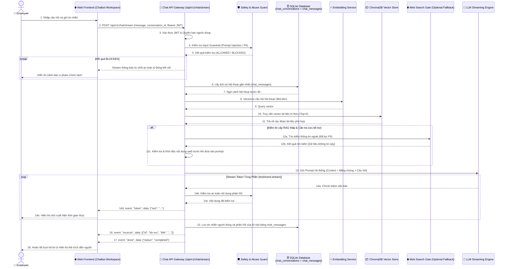

# D2 — Realtime Chat Data Flow (Luồng Dữ Liệu Hội Thoại Trực Tiếp)

> **Tài liệu bổ sung:** Sơ đồ này làm rõ một phần của kiến trúc MVP P-236. Nội dung có thể được điều chỉnh trong quá trình tiếp tục tích hợp và không đại diện cho kiến trúc production cuối cùng.
>
> `Core MVP` biểu thị thành phần thuộc phạm vi MVP, không mặc định rằng thành phần đã hoàn thiện hoặc được xác minh end-to-end.

---

## 1. Sơ Đồ D2: Realtime Streaming Chat Data Flow

Sơ đồ thể hiện quy trình khi người dùng gửi tin nhắn qua giao diện Web Chatbot (HTTPS POST tới `/api/v1/chat/stream`) và máy chủ FastAPI trả về luồng phản hồi dạng **Server-Sent Events (`text/event-stream`)**.

---

## 2. Các Biện Pháp An Toàn Trong Luồng Chat

1. **Xác thực trước khi xử lý (*Auth Pre-check*):** Mọi request tới `/api/v1/chat` hoặc `/api/v1/chat/stream` đều bắt buộc phải mang theo JWT Token hợp lệ để định danh người dùng.
2. **Khử nhiễm dữ liệu ngoài (*Web Sanitization*):** Dữ liệu tra cứu từ Internet được coi là dữ liệu thô chưa kiểm chứng (*Untrusted Content*), luôn được bóc tách và lọc thẻ độc hại trước khi đưa vào ngữ cảnh LLM.
3. **Kiểm soát an toàn nội dung (*Output Guardrail*):** Hệ thống thực hiện rà soát an toàn nội dung trước hoặc trong quá trình trả phản hồi, nhằm phát hiện và che giấu các mẫu thông tin nhạy cảm như mật khẩu, khóa API hoặc số điện thoại.
