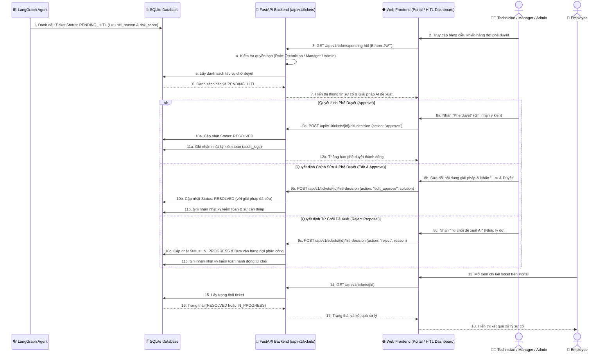

# D3 — HITL Approval Data Flow (Luồng Phê Duyệt Có Con Người Tham Gia)

> **Tài liệu bổ sung:** Sơ đồ này làm rõ một phần của kiến trúc MVP P-236. Nội dung có thể được điều chỉnh trong quá trình tiếp tục tích hợp và không đại diện cho kiến trúc production cuối cùng.
>
> `Core MVP` biểu thị thành phần thuộc phạm vi MVP, không mặc định rằng thành phần đã hoàn thiện hoặc được xác minh end-to-end.

---

## 1. Sơ Đồ D3: Human-in-the-Loop (HITL) Approval Flow

Sơ đồ thể hiện quy trình xử lý khi tác nhân AI phát hiện tác vụ có rủi ro cao hoặc cần phê duyệt nghiệp vụ từ **Technician**, **Manager** hoặc **Admin**.

---

## 2. Quy Tắc Xử Lý Khi Từ Chối Đề Xuất (Reject Behavior)

Khi Kỹ thuật viên, Quản lý hoặc Quản trị viên từ chối đề xuất tự động của AI:
1. **Không đóng vé:** Hệ thống không chuyển vé sang trạng thái `CLOSED` trong luồng Reject của MVP để tránh bỏ sót sự cố của nhân viên.
2. **Chuyển sang xử lý thủ công:** Trạng thái vé được chuyển thành `IN_PROGRESS` và đưa vào hàng đợi phân công cho Kỹ thuật viên chuyên trách xử lý trực tiếp.
3. **Lưu vết đầy đủ (*Audit Trail*):** Mọi thao tác Phê duyệt, Chỉnh sửa hay Từ chối đều được ghi nhận chi tiết vào bảng `audit_logs` nhằm hỗ trợ truy vết và kiểm toán hệ thống.
