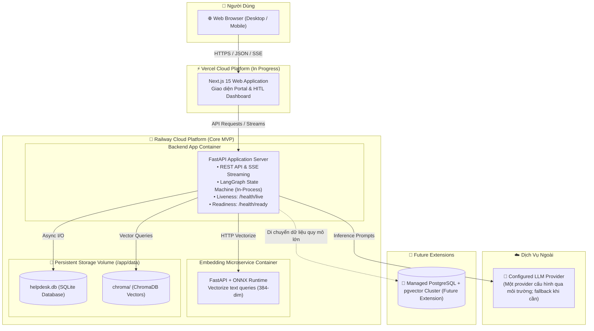
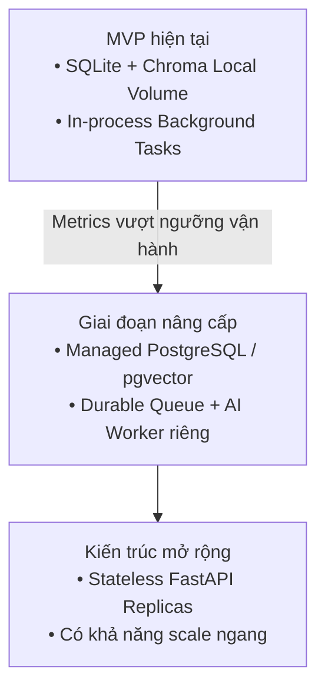

# MVP Deployment Architecture & Design Decisions

> **Tài liệu bổ sung:** Sơ đồ này làm rõ một phần của kiến trúc MVP P-236. Nội dung có thể được điều chỉnh trong quá trình tiếp tục tích hợp và không đại diện cho kiến trúc production cuối cùng.
>
> `Core MVP` biểu thị thành phần thuộc phạm vi MVP, không mặc định rằng thành phần đã hoàn thiện hoặc được xác minh end-to-end.
>
> ONNX Runtime là phương án triển khai hiện tại của Embedding Service, không phải ràng buộc kiến trúc và có thể được thay thế bằng model hoặc provider tương thích.

---

## 1. Sơ Đồ Hạ Tầng Triển Khai (Deployment Topology)

Sơ đồ mô tả cấu hình triển khai MVP hiện tại và các thành phần đang được tích hợp.

---

## 2. Preliminary Architecture Decisions (Các Quyết Định Kiến Trúc Sơ Bộ)

### PAD-001: Sử Dụng In-Process LangGraph Thay Vì Standalone Agent Container
* **Bối cảnh:** Cần xây dựng đồ thị trạng thái điều phối tác vụ với độ trễ thấp và dễ dàng chia sẻ bộ nhớ phiên.
* **Quyết định:** Chạy LangGraph trực tiếp bên trong tiến trình FastAPI.
* **Hệ quả:** Đơn giản hóa kiến trúc triển khai, giảm độ phức tạp giao tiếp mạng giữa các tiến trình.

### PAD-002: Kiến Trúc Phục Hồi Khi Mất Dịch Vụ Embedding (Degraded Mode Fallback) [Proposed]
* **Bối cảnh:** Dịch vụ tạo vector ngữ nghĩa có thể gặp sự cố mạng hoặc quá tải.
* **Quyết định [Đề xuất]:** Nếu dense retrieval không khả dụng, hệ thống chuyển sang lexical-only retrieval. Tính năng Auto-resolve bị vô hiệu hóa nếu bằng chứng không đủ, và chuyển vé sang Kỹ thuật viên xử lý thủ công.
* **Hệ quả:** Cho phép hệ thống tiếp tục hoạt động ở chế độ suy giảm (*Degraded Mode*), giảm rủi ro phản hồi thiếu căn cứ khi thiếu ngữ cảnh.

### PAD-003: Cổng Phê Duyệt An Toàn Có Người Tham Gia (Human-in-the-Loop Gate)
* **Bối cảnh:** Các tác vụ can thiệp quyền hạn hoặc sự cố nghiêm trọng có nguy cơ rủi ro cao.
* **Quyết định:** LLM chỉ có vai trò đề xuất giải pháp; các hành động thay đổi trạng thái nhạy cảm được chuyển qua xác nhận của Technician, Manager hoặc Admin có thẩm quyền tại bảng điều khiển HITL.
* **Hệ quả:** Kiểm soát an toàn vận hành và hỗ trợ truy vết, kiểm toán hệ thống.

### PAD-004: Tách Biệt Vai Trò Bền Vững Của Dữ Liệu
* **Bối cảnh:** Cần lưu trữ cả dữ liệu quan hệ có cấu trúc và dữ liệu vector phi cấu trúc.
* **Quyết định:** Sử dụng SQLite cho dữ liệu nghiệp vụ có cấu trúc (`/app/data/helpdesk.db`) và ChromaDB cho vector tri thức (`/app/data/chroma`) trong giai đoạn MVP; chuẩn bị sẵn khả năng nâng cấp lên PostgreSQL + pgvector khi mở rộng.
* **Hệ quả:** Tối ưu hóa chi phí vận hành ban đầu trong khi vẫn giữ cấu trúc mở cho giai đoạn phát triển tiếp theo.

---

## 3. Known MVP Constraints & Evolution Triggers

Bảng trình bày các giới hạn đã biết của cấu hình MVP hiện tại; mức độ ảnh hưởng phụ thuộc vào tải thực tế và sẽ được đánh giá bằng các metrics vận hành khi telemetry tương ứng được triển khai trước khi kích hoạt kế hoạch nâng cấp hạ tầng.

| Thành Phần Hiện Tại | Giới Hạn Đã Biết Trong MVP | Mức Độ Trong MVP | Hướng Xử Lý & Điều Kiện Nâng Cấp |
| :--- | :--- | :---: | :--- |
| **SQLite + WAL Mode** | Chế độ WAL cho phép đọc đồng thời với ghi, nhưng tại một thời điểm SQLite chỉ cho phép một writer. Khi số giao dịch ghi đồng thời tăng cao, thao tác có thể phải chờ hoặc phát sinh `SQLITE_BUSY` nếu vượt quá thời gian chờ. | Trung bình trong MVP; Cao khi tải ghi tăng | Giữ transaction ngắn, cấu hình `busy_timeout`, retry có giới hạn và giám sát write latency qua telemetry. Chuyển sang **Managed PostgreSQL** khi số lượng ghi đồng thời vượt ngưỡng đáp ứng của SQLite. |
| **LangGraph in FastAPI (In-process)** | Background Task dùng chung tiến trình và tài nguyên CPU/RAM với FastAPI. Các tác vụ xử lý đồ thị AI kéo dài hoặc CPU-bound có thể cạnh tranh tài nguyên; tác vụ in-process cũng không bền vững khi container khởi động lại. | Trung bình | Áp dụng timeout, tính lũy đẳng (idempotency) và giới hạn concurrency trong MVP. Khi lưu lượng tăng cao, tách tiến trình thực thi AI sang **Dedicated AI Worker kết hợp durable job queue** (ví dụ: Celery worker với Redis hoặc RabbitMQ làm broker). |
| **Railway Persistent Volume** | Cấu hình lưu trữ file SQLite và ChromaDB trực tiếp trên Persistent Volume khiến backend phụ thuộc vào trạng thái cục bộ của ổ đĩa. Nền tảng không hỗ trợ replicas đối với service gắn volume, tạo ranh giới đối với scale ngang. | Thấp–Trung bình ở 1 replica; Cao khi cần scale ngang | Tách dữ liệu nghiệp vụ ra PostgreSQL và vector store độc lập; chuyển API FastAPI thành dạng phi trạng thái (**Stateless API**) để có thể triển khai nhiều replicas theo tải. |
| **ChromaDB Local Persistence** | `PersistentClient` đang được sử dụng trong cấu hình MVP hiện tại; cấu hình local persistence chủ yếu phù hợp với phát triển và thử nghiệm, việc thiết lập cơ chế sao lưu/khôi phục, High Availability (HA) và scale-out cần được xử lý riêng. | Trung bình | Có thể chuyển sang mô hình Chroma Client-Server trong giai đoạn trung gian hoặc tích hợp thẳng vào **PostgreSQL + pgvector**; đảm bảo vector index luôn có khả năng tái tạo từ kho tài liệu gốc. |

### Lộ Trình Tiến Hóa Kiến Trúc (Architecture Evolution Roadmap)

