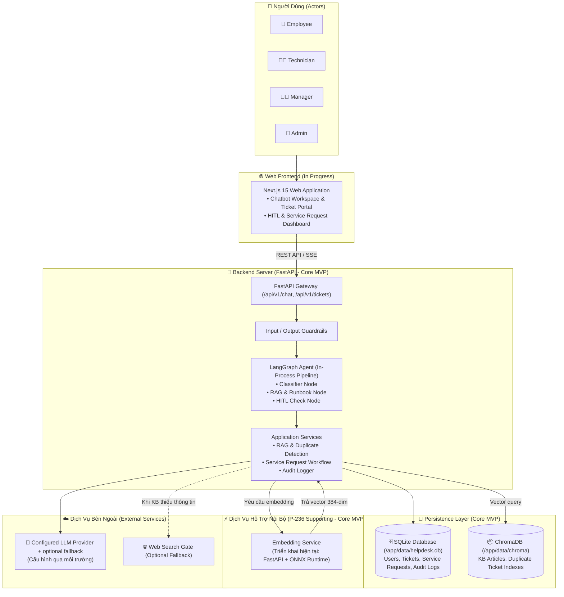
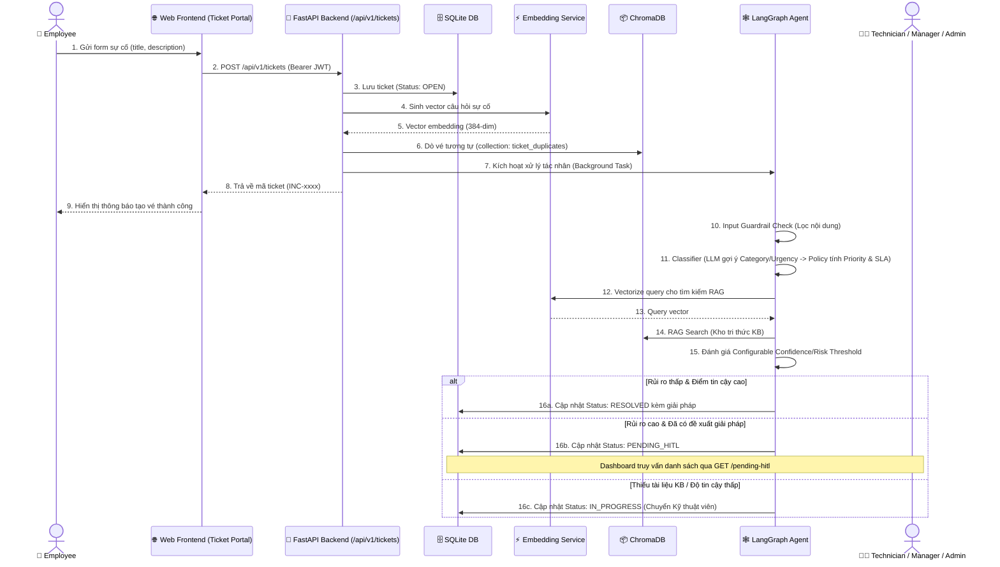

# Kiến trúc MVP P-236 — Thành phần, Luồng dữ liệu và Triển khai
## P-236 MVP Architecture: Components, Data Flow & Deployment

> **Tài liệu chính (Deliverable #3):** Tài liệu trình bày kiến trúc MVP của P-236, tập trung vào các thành phần và luồng dữ liệu cần thiết để hoàn thành những chức năng chính. Một số thành phần đang được tích hợp hoặc có thể thay đổi trong các phiên bản tiếp theo.
>
> `Core MVP` biểu thị thành phần thuộc phạm vi MVP, không mặc định rằng thành phần đã hoàn thiện hoặc được xác minh end-to-end.
>
> ONNX Runtime là phương án triển khai hiện tại của Embedding Service, không phải ràng buộc kiến trúc và có thể được thay thế bằng model hoặc provider tương thích.

---

## 1. Tổng Quan Kiến Trúc Hệ Thống (System Architecture Overview)

Sơ đồ thể hiện kiến trúc tổng thể các thành phần chính trong hệ thống **P-236 MVP**.

---

## 2. Luồng Dữ Liệu Xử Lý Sự Cố Cốt Lõi (Core Ticket Data Flow)

Luồng xử lý dữ liệu chính từ khi tiếp nhận sự cố qua giao diện người dùng cho đến khi đề xuất giải pháp hoặc chuyển con người xử lý.

---

## 3. Bảng Tóm Tắt Các Thành Phần Chính (Core Component Summary)

| Thành Phần | Công Nghệ / Triển Khai Hiện Tại | Trạng Thái | Vai Trò Chính Trong MVP |
| :--- | :--- | :---: | :--- |
| **Web Frontend** | Next.js 15 (React 19, TypeScript, Tailwind) | `In Progress` | Cung cấp giao diện Portal, Chatbot Workspace, quản lý Ticket, Service Request và màn hình duyệt HITL. |
| **API Gateway** | FastAPI (Python 3.11, Uvicorn) | `Core MVP` | Xử lý RESTful endpoints (`/chat`, `/tickets`, `/service-requests`), streaming SSE, xác thực JWT và RBAC. |
| **AI Agent** | LangGraph (In-process StateGraph) | `Core MVP` | Điều phối quy trình phân loại, tìm kiếm RAG tri thức nội bộ, đánh giá rủi ro và ra quyết định hành động. |
| **Database** | SQLite (Async SQLAlchemy, `/app/data/helpdesk.db`) | `Core MVP` | Lưu trữ bền vững thông tin người dùng, vé sự cố, yêu cầu dịch vụ, lịch sử hội thoại và nhật ký kiểm toán. |
| **Vector Store** | ChromaDB (Local Persistent, `/app/data/chroma`) | `Core MVP` | Lưu trữ và truy vấn vector tương đồng cho tài liệu tri thức (KB) và vé sự cố lịch sử (dò trùng lặp). |
| **Embedding Service** | Triển khai hiện tại: FastAPI + ONNX Runtime (384-dim) | `Core MVP` | Dịch vụ vector hóa văn bản đa ngôn ngữ phục vụ tìm kiếm ngữ nghĩa; có thể thay đổi backend linh hoạt. |
| **LLM Provider** | Configured LLM Provider + optional fallback | `Core MVP` | Một provider được chọn qua cấu hình môi trường; fallback được sử dụng khi được cấu hình. |
| **Relational DB Nâng cao** | PostgreSQL / pgvector | `Future Extension` | Mở rộng khả năng lưu trữ và truy vấn vector quy mô lớn khi tải tăng cao. |
| **Giám Sát Telemetry** | OpenTelemetry | `In Progress` | Thu thập metrics, tracing và phân tích hiệu năng thực thi tác nhân AI. |
| **Giám Sát Metrics/Trace** | Prometheus / Tempo | `Future Extension` | Ngăn xếp giám sát hạ tầng và dashboard phân tích mở rộng. |

---

## 4. Chi Tiết Kiến Trúc Bổ Sung (Detailed Architecture Documents)

Để xem phân tích kỹ thuật chi tiết theo từng khía cạnh, vui lòng tham khảo các tài liệu chuyên đề trong thư mục [`docs/architecture/`](architecture/):

* [**C1 — System Context Diagram**](architecture/01-system-context.md): Bối cảnh hệ thống, ranh giới và tương tác với các Actor.
* [**C2 — Container Architecture**](architecture/02-container-architecture.md): Phân rã ứng dụng, container và giao thức kết nối.
* [**C3A — Backend Component Diagram**](architecture/03-backend-components.md): Chi tiết các API Router, Middleware và Service Layer.
* [**C3B — Agent StateGraph Diagram**](architecture/04-agent-components.md): Đồ thị tác nhân LangGraph và các Node xử lý.
* [**D1 — Ticket Auto-Triage Data Flow**](architecture/05-ticket-data-flow.md): Luồng dữ liệu xử lý vé sự cố và dò trùng lặp.
* [**D2 — Realtime Chat Data Flow**](architecture/06-chat-data-flow.md): Luồng dữ liệu trò chuyện trực tiếp và streaming SSE.
* [**D3 — HITL Approval Data Flow**](architecture/07-hitl-data-flow.md): Luồng phê duyệt can thiệp của Quản lý và Kỹ thuật viên.
* [**Deployment Architecture & Design Decisions**](architecture/08-deployment-view.md): Hạ tầng triển khai, mẫu thiết kế và các quyết định kiến trúc sơ bộ.

---

## 5. Quy Ước Kiến Trúc & Chuyển Trạng Thái (Architecture Notes & State Transitions)

1. **Chuẩn hóa vai trò người dùng (Roles):** `Employee`, `Technician`, `Manager`, `Admin` (được phân quyền RBAC rõ ràng).
2. **Vòng đời chuyển trạng thái Ticket đầy đủ:**
   - `OPEN → RESOLVED | PENDING_HITL | IN_PROGRESS`
   - `PENDING_HITL → RESOLVED | IN_PROGRESS`
   - `IN_PROGRESS → RESOLVED` (sau khi Kỹ thuật viên hoàn tất xử lý kỹ thuật)
   - `RESOLVED → CLOSED` (sau bước xác nhận của người dùng/hệ thống).
3. **Ngưỡng quyết định (Thresholds):** Hệ thống sử dụng các ngưỡng đánh giá tin cậy (*Configurable confidence/risk thresholds*) cho phép cấu hình theo chính sách từng tổ chức.
4. **Quy tắc an toàn:** Hệ thống ưu tiên câu trả lời có nguồn trích dẫn từ tài liệu tri thức nội bộ; nếu thiếu bằng chứng, hệ thống chuyển Kỹ thuật viên (`IN_PROGRESS`); nếu mô tả chưa rõ ràng, giữ `OPEN` và yêu cầu làm rõ (*Clarification*); nếu rủi ro cao, chuyển duyệt **Human-in-the-Loop** (`PENDING_HITL`).
