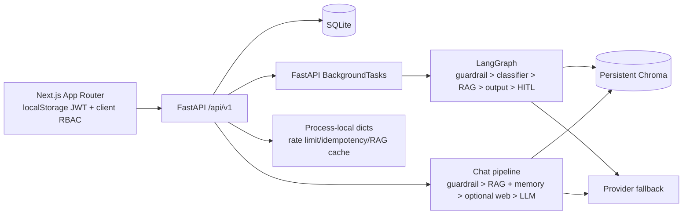
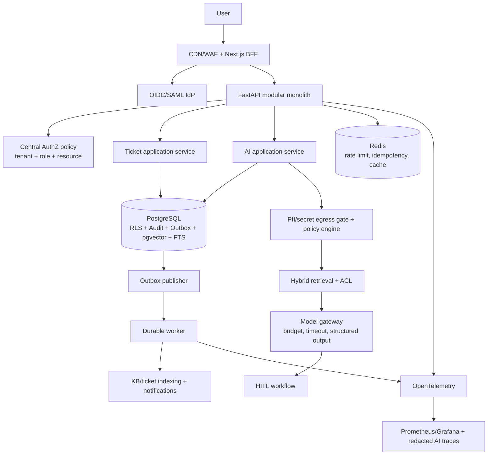

# Full System Architecture Review

Date: 2026-08-10  
Scope: FastAPI, Next.js, SQLite/Chroma, RAG, ticket workflow, security, observability, CI and tests.

## 1. Executive Summary

The system is a capable prototype/pilot: it has a clear FastAPI module split, an explicit LangGraph workflow, RAG ACL filtering, duplicate-ticket prevention, streaming responses, audit concepts, and a useful test suite. It is **not enterprise-production ready** today.

The blockers are not the choice of FastAPI or LangGraph. They are identity and tenant-boundary failures, demo authentication enabled in every environment, non-durable background work, data-store drift, and untrustworthy observability. A production launch should be blocked until all P0 items below are resolved and independently tested.

Runtime evidence gathered during this review:

- SQLite: 7 users, 63 tickets, 227 KB rows, 0 `ai_runs`, 4 web-research runs, and 78 episodic traces.
- Chroma: 430 KB vectors, 63 duplicate vectors, and 78 episodic vectors. The application seed has only 35 KB entries.
- Existing RAG report was generated against 295 vectors on 2026-08-04; its answer faithfulness and focus were null. Existing performance evidence uses eight queries, reports p95 7.50s and security pass rate 0.62.
- `ruff check src tests eval` currently reports 243 violations. The test suite passes, but the production quality gate is not green.

## 2. Current Architecture Assessment

### Current implementation

### What should be retained

- FastAPI and async SQLAlchemy are appropriate.
- LangGraph should stay. The ticket flow is a deterministic stateful workflow, not an open-ended agent.
- The duplicate detector, provenance-only episodic memory, citations, and the internal-before-web retrieval policy are good directions.
- Do not introduce Kafka, Milvus, ColBERT, CQRS everywhere, or another agent framework at the present workload. They add complexity without a demonstrated benefit.

### Structural assessment

The code is organised by technical layer (`api`, `services`, `models`, `agents`), which is workable for a pilot. It is not yet a clean enterprise boundary: routes access service/data concerns directly, side effects are mixed with transaction handling, and the ticket and chat AI flows duplicate policy and generation logic. A **pragmatic hexagonal / modular-monolith refactor** is recommended, not a disruptive full DDD rewrite.

Use bounded modules: Identity & Access, Ticketing, Knowledge, AI Orchestration, Search, Notification, and Audit. Each module owns its application service, ports, repository interface, domain policy, and events. Apply CQRS only to analytics/read projections; use a transactional outbox for integration events.

## 3. Problems Found

| Location | Severity | Current approach and why it is problematic | Recommended solution |
|---|---|---|---|
| `src/api/auth.py:60`, `src/models/schemas.py` | **Critical** | Public `/auth/register` accepts `UserCreate`, including `role`, `company_unit`, and `is_vip`. An anonymous caller can register an admin. | Disable registration outside development immediately. Provision users only via admin/SCIM/IdP; server-side allowlist every assignable role. Add a regression test that anonymous admin creation is impossible. |
| `src/main.py`, `src/config.py`, `frontend/src/app/login/page.tsx` | **Critical** | Demo accounts with known passwords are seeded on every startup, shown in the UI, and the JWT secret has an insecure default. | Require an explicit `DEMO_MODE=true` only in development; refuse startup in production with default/missing secrets. Remove credentials from the production bundle. Use OIDC/SAML SSO and managed secrets. |
| `src/api/admin.py:60`, `src/api/analytics.py`, `src/api/tickets.py:585-818` | **Critical** | Tenant checks are inconsistent. Any authenticated user can list all KB content; analytics, SLA alerts and audit logs expose global data; several ticket mutation/HITL endpoints check role but not tenant/resource scope. | Centralise `authorize(action, resource, principal)` and invoke it before every read/mutation. Enforce tenant predicates in repositories and PostgreSQL RLS. Add cross-tenant negative tests for every endpoint. |
| `src/services/ticket_service.py:235+` | **Critical** | Closing a ticket auto-indexes its title, description and solution as `company_unit=all`, without classification, approval, redaction or retention controls. Confidential ticket data can become globally retrievable. | Disable auto-KB publication. Create a reviewable `KnowledgeCandidate` workflow: PII/secret scan, owner/tenant classification, SME approval, versioned publication, then index. |
| `src/api/tickets.py:41`, `src/assignment/rate_limiter.py` | **High** | Idempotency and rate limiting are process-local, unbounded/no TTL (idempotency), and fail under restart or multi-worker deployment. Idempotency keys are not scoped to a user/request fingerprint. | Store idempotency records in Redis/PostgreSQL with user+route+payload hash, TTL and response status. Use Redis atomic sliding window/token bucket. |
| `src/api/tickets.py:260+`, `src/main.py` | **High** | AI jobs use `BackgroundTasks`; startup seeds/reindexes synchronously. Jobs are lost on restart, have no retry/dead-letter/idempotency, and block deployment readiness. | Use transactional outbox plus a durable worker queue. Start with Celery/Redis or an async Redis worker; introduce Kafka only for real multi-service integration volume. Make indexing and workflow jobs idempotent. |
| `src/services/rag_service.py`, runtime stores | **High** | SQLite has 227 KB rows while Chroma has 430 vectors and seed source has 35. There is no authoritative index manifest, atomic DB/vector write, delete reconciliation, or freshness SLO. | Make PostgreSQL KB metadata/version state authoritative. Maintain an outbox-driven indexer and a reconciliation job that reports orphan/missing/version-mismatched vectors. Block stale documents from retrieval. |
| `src/database.py:118-126`, `src/models/knowledge_base.py` | **High** | SQLite schema auto-migration is hand-written; KB migration columns are declared but never applied in the shown loop, while the ORM lacks version fields that exist in the live DB. This is schema drift and cannot be safely reproduced. | Replace runtime ALTER TABLE logic with Alembic revisions. Map all persistent columns in ORM, enforce migration-at-deploy, and run migration smoke tests against an empty database and an upgrade fixture. |
| `src/models/ai_run.py`, `src/api/admin.py:230+` | **High** | `/admin/ai-metrics` references `confidence_score`, `estimated_cost_usd`, `hitl_triggered`, `node_name`, and `model_name`, none of which exist on `AIRun`; live `ai_runs` is zero. Metrics endpoint will fail once it queries data. | Define a stable trace/event schema, write an `AIRun` for every AI operation, and test the endpoint against real rows. Use `classification_confidence`, `estimated_cost`, `decision`, `model` or migrate deliberately. |
| `src/services/ai_logger.py`, `.ai-log` | **High** | Classifier prompts and answer summaries are written to local JSONL. This can retain ticket/KB/PII without encryption, access control, retention, or a privacy policy. | Remove raw content from routine logs; log hashes/metadata. Send approved traces via OTel to a controlled backend with field redaction, encryption, RBAC and retention/deletion policies. |
| `src/services/ticket_conversation_service.py`, `src/models/ticket.py`, schemas | **High** | Raw `agent_reasoning` is stored and returned in ticket responses. It can expose untrusted model rationale, prompt fragments, or internal logic. | Never persist or expose chain-of-thought. Replace it with a server-generated structured `decision_summary`, policy IDs, source IDs, confidence, and escalation reason. |
| `src/guardrails/input_guardrails.py`, `output_guardrails.py` | **High** | Regex is useful as a first layer but is bypassable by paraphrase/language variation. Optional external safety calls use synchronous `requests` in async paths; Gemini failure returns SAFE; input PII is not a universal egress gate. | Keep local rules, add Presidio-based PII detection/redaction before every external call, and use async clients with explicit fail-closed policy for high-risk actions. Evaluate a managed guard service only if recall/operations justify cost; do not rely on it alone. |
| `src/services/rag_service.py:search_similar` | **Medium** | “Hybrid” retrieval is lexical re-scoring of dense top-N, not corpus-wide BM25. In-memory cache has no TTL/invalidation and Chroma is the ACL candidate source. | Use true hybrid search: PostgreSQL `tsvector`/BM25-equivalent plus pgvector HNSW, reciprocal-rank fusion, then ACL/RLS in the same query. Add conditional cross-encoder reranking for low-confidence/high-impact requests. |
| `src/services/llm.py`, LangGraph state | **Medium** | Provider fallback has no circuit breaker, per-tenant budget, structured-output contract, model capability registry, or durable checkpoint. Classifier parses LLM JSON manually. | Use Pydantic structured output, timeout/retry/circuit-breaker policy, model routing by task/risk, token budgets, and LangGraph Postgres checkpointer. Retain LangGraph. |
| `src/database.py`, `docker-compose.yml` | **High** | SQLite WAL and local Chroma files are acceptable for a single-node demo, not HA, backup/restore, concurrent writes, PITR, RLS, or horizontal API workers. Docker Compose has no Postgres/Redis/worker, resource limits, TLS, or backup plan. | Migrate transactional data to managed PostgreSQL, use Redis, and run separate API/worker processes. Use pgvector at this scale; retain a separate search engine only after measured need. |
| `frontend/src/lib/api.ts`, `authStore.ts`, `PortalShell.tsx` | **High** | JWT and user role live in `localStorage`; client role drives portal routing and can be modified by XSS/local tampering. Client guards are UX only. | Prefer BFF/httpOnly Secure SameSite cookies, short access + rotating refresh, CSP, and server/middleware route checks. Backend remains the enforcement point. |
| `ARCHITECTURE.md`, `README.md`, source/KB strings | **Medium** | Documentation is template/stale, and many Vietnamese strings are mojibake. Documentation claims diverge from code/runtime. | Repair UTF-8 source data, add UTF-8 validation in CI, replace template docs with ADRs, threat model, data classification and operational runbooks. |
| `.github/workflows/ci.yml` | **Medium** | CI runs only backend ruff/tests. Current lint is failing (243 violations); no frontend build/lint, migration, SAST, dependency scan, tenant-security, load, or evaluation gate. | Make green CI mandatory: ruff, type check, pytest, migration upgrade test, frontend lint/build, secret/SCA/SAST scan, API authorization tests, and benchmark/eval thresholds. |

## 4. Technology Comparison

| Current | Alternative | Decision |
|---|---|---|
| SQLite + local Chroma | PostgreSQL + pgvector + `tsvector`; Redis | **Replace for production.** One transactional source enables RLS, backups/PITR, migrations, ACID outbox and hybrid search. Current corpus is far below the scale requiring Milvus/Weaviate. |
| Chroma as KB/duplicate/memory store | pgvector now; Qdrant only when vector workload is independently large | **Migrate gradually.** Qdrant is a valid future option for high-QPS/million-vector ANN, but not justified by 430 KB vectors. |
| Dense search + lexical boost | `tsvector` + pgvector RRF + optional cross-encoder | **Upgrade.** This is real hybrid retrieval and removes a split ACL/data plane. Use multi-query/contextual retrieval only when low confidence; do not apply to every request. |
| FastAPI `BackgroundTasks` | Transactional outbox + Celery/Redis (or async Redis worker) | **Replace.** Gives retry, durability, observability and idempotency. Kafka is P2 until there are multiple independent consumers/high event volume. |
| Regex + optional Lakera/Gemini calls | Hybrid local policy + Presidio + tested external safety service | **Upgrade controls, not vendor by default.** Keep deterministic rules; require benchmarked recall/latency before buying Lakera/Azure/NeMo. |
| LangGraph | LangGraph with Postgres checkpoint, typed contracts and outbox | **Keep.** Semantic Kernel, ADK, LlamaIndex and OpenAI Agents SDK would duplicate orchestration without solving the identified risks. |
| LangSmith/local JSONL | OpenTelemetry + Prometheus/Grafana + controlled trace backend (Phoenix/Langfuse/LangSmith) | **Upgrade.** Emit redacted traces and metrics with a correlation ID; never dump raw prompts by default. |

## 5. Recommended Target Architecture

Key invariants:

1. Tenant and authorization are evaluated before data query and enforced again by RLS.
2. PostgreSQL transaction is authoritative; indexing and integrations consume committed outbox events.
3. External LLM/search calls receive a minimised/redacted payload only after an egress policy decision.
4. AI output is structured, source-bound and safety-checked before streaming/persistence.
5. Every state transition uses an allowed-transition policy plus optimistic concurrency/versioning.

## 6. Migration Plan

### Phase 1 — Contain risk (P0, 1-2 weeks)

1. Disable public registration and production demo seeding; reject default JWT secret at startup.
2. Add a central resource authorization dependency; lock down KB, analytics, audit, SLA, HITL and all ticket mutations.
3. Disable global auto-KB creation; quarantine existing auto-generated documents for review.
4. Fix `AIRun` model/endpoint mismatch and stop raw prompt/response logging.
5. Add tenant-isolation, privilege-escalation and cross-ticket mutation tests; make CI fail on them.
6. Remove or repair mojibake KB/documentation content; validate UTF-8.

### Phase 2 — Reliability and data consistency (P1, 2-5 weeks)

1. Introduce Alembic and remove runtime SQLite migrations.
2. Add Redis-backed idempotency/rate limiting/cache with tenant-aware keys and TTLs.
3. Add transactional outbox and a durable worker; move workflow, index and crawl work out of request/startup paths.
4. Create a canonical KB document model with owner, tenant, security classification, version/hash, effective interval and publication state.
5. Build reconciliation: DB records versus vectors, duplicate vectors, deleted documents, embedding-model version and ACL metadata.

### Phase 3 — Enterprise production upgrade (P1/P2, 4-8 weeks)

1. Migrate SQLite to PostgreSQL using dual-write validation, backfill, read-only cutover, rollback window and restore rehearsal.
2. Migrate Chroma collections to pgvector/FTS with retrieval parity benchmarks and ACL tests. Keep Chroma read-only until parity is signed off.
3. Move to OIDC/SAML SSO, rotating sessions and SCIM provisioning.
4. Add OTel, dashboards, SLOs, redacted AI tracing, immutable audit retention, backups/PITR and incident runbooks.
5. Add load test and red-team gates before production launch.

## 7. Code Change Priority

### P0 — Must fix before external/enterprise use

- Public privilege escalation, demo accounts, default JWT secret.
- Tenant isolation across KB, analytics, audit, HITL and ticket state mutations.
- Global auto-publication of ticket data to KB.
- `AIRun` schema/API mismatch and raw sensitive AI logs.
- Durable handling for ticket/AI jobs and idempotency.

### P1 — Should complete for production readiness

- PostgreSQL + Redis migration, Alembic, transactional outbox and worker.
- Canonical KB lifecycle and vector reconciliation.
- True hybrid retrieval with conditional reranking.
- Egress/PII policy, structured LLM outputs, circuit breakers and cost budgets.
- OTel, meaningful SLO dashboards, updated performance/evaluation evidence.
- CI quality/security gates and frontend validation.

### P2 — Add after measurement justifies it

- Qdrant for independently scaled vector serving.
- Kafka/event bus for multiple services/consumers.
- ColBERT/late interaction retrieval for a much larger corpus and measured recall gap.
- Full CQRS projections beyond analytics/reporting.

## Testing and Exit Criteria

- 100% endpoint authorization matrix: anonymous, employee, technician, manager, admin, same-tenant and cross-tenant.
- Migration upgrade/downgrade and backup/restore rehearsal pass.
- No orphan/missing vectors after reconciliation; a versioned parity report is produced at every index deployment.
- Golden evaluation includes grounded answers, citations, refusal, PII egress, indirect prompt injection and tenant conflict cases; score gates are calibrated from human review, not arbitrary thresholds.
- Load tests meet published p50/p95/p99 and queue-depth SLOs with external-provider degradation.
- Security pass rate must be 100% for P0 red-team scenarios; the existing 0.62 result is not an acceptable production baseline.
