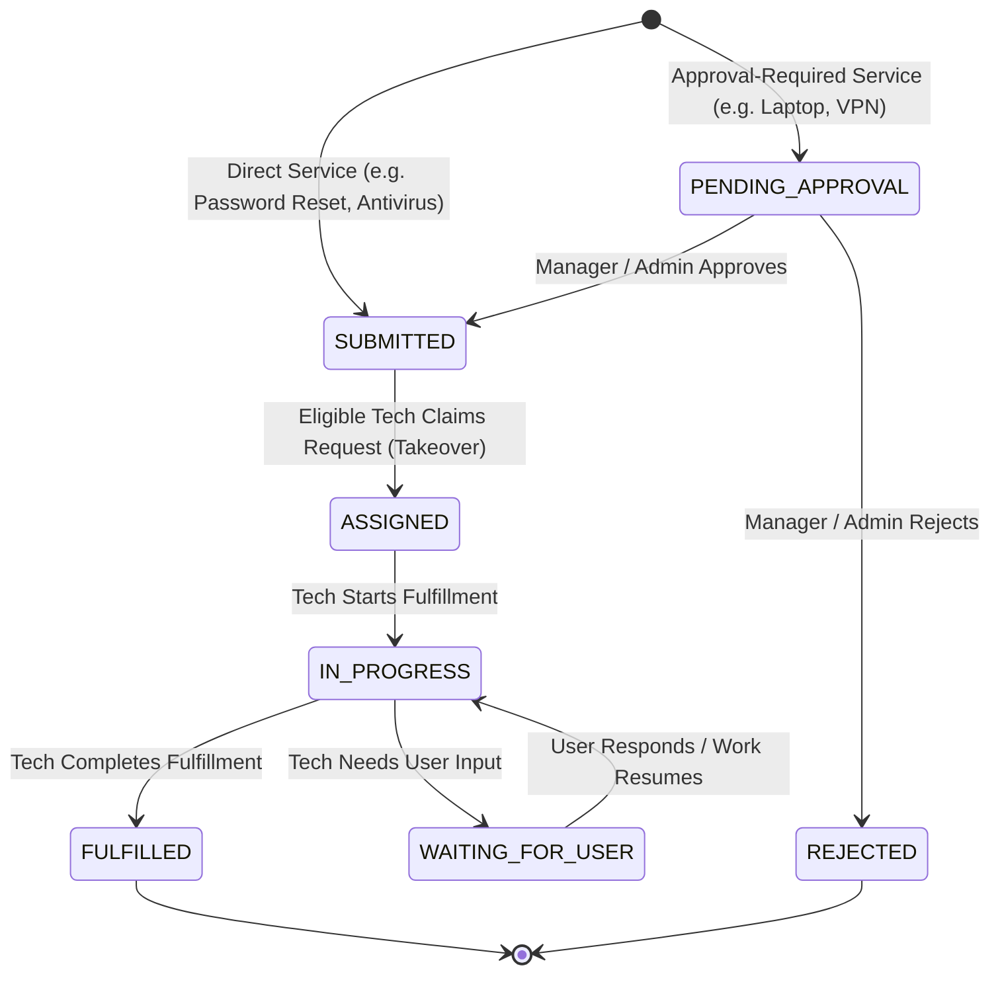

# Evaluation & Audit Report: KB-GAP-1 Service Request Process Knowledge Grounding v1.0

## Executive Summary
This report validates the resolution of the **Service Request Process Knowledge Gap (`KB-GAP-1`)**.
A canonical, authoritative Knowledge Base article ([`kb-036`](file:///C:/Users/Admin/Python%20Advanced/VinAI%20Lab/P-236/src/data/service_request_kb.py)) has been created and indexed into the active ChromaDB vector collection (`helpdesk_kb_multilingual_v2_sentence_transformer`) using the canonical SentenceTransformer embedding pipeline (`sentence-transformers/paraphrase-multilingual-MiniLM-L12-v2`, 384 dimensions).

The article is grounded 100% in the actual implemented P-236 Service Request state machine, catalog policies, approval workflows, and technician fulfillment groups without any invented behavior or security leaks.

---

## 1. Authoritative Source-of-Truth Audit

The following files were inspected to ground the knowledge article:
1. [`src/services/service_request_service.py`](file:///C:/Users/Admin/Python%20Advanced/VinAI%20Lab/P-236/src/services/service_request_service.py): Server-owned `SERVICE_POLICIES` and `SERVICE_CATEGORIES`, state transition state machine (`_TECHNICIAN_TRANSITIONS`), approval logic (`approve_service_request`, `reject_service_request`), technician takeover (`take_service_request`), queue filters (`list_technician_queue`).
2. [`src/models/service_request.py`](file:///C:/Users/Admin/Python%20Advanced/VinAI%20Lab/P-236/src/models/service_request.py): Domain model, `ServiceRequestStatus` enum, identifiers (`request_number` format `REQ-YYYYMMDD-XXXX`), independent fulfillment fields.
3. [`src/models/technician_fulfillment_group.py`](file:///C:/Users/Admin/Python%20Advanced/VinAI%20Lab/P-236/src/models/technician_fulfillment_group.py): Explicit group membership mapping.
4. [`src/api/service_requests.py`](file:///C:/Users/Admin/Python%20Advanced/VinAI%20Lab/P-236/src/api/service_requests.py): RBAC authorization and queue visibility.
5. [`tests/e2e/test_service_request_approval_v1_0.py`](file:///C:/Users/Admin/Python%20Advanced/VinAI%20Lab/P-236/tests/e2e/test_service_request_approval_v1_0.py) & [`test_service_request_fulfillment_v1_0.py`](file:///C:/Users/Admin/Python%20Advanced/VinAI%20Lab/P-236/tests/e2e/test_service_request_fulfillment_v1_0.py): Verified end-to-end approval and fulfillment invariants.

---

## 2. Verified Service Request State Machine

---

## 3. Article Metadata & Provenance

| Field | Value |
|---|---|
| **Article ID** | `kb-036` |
| **Title** | `Quy trình Service Request / Yêu cầu dịch vụ CNTT` |
| **Category** | `service_request` |
| **Source Provenance** | Internally derived from P-236 Service Request domain code |
| **ACL Scope** | `applicable_to_all: True` (Tenant: `all`, Department: `all`) |
| **Chroma Collection** | `helpdesk_kb_multilingual_v2_sentence_transformer` |
| **Embedding Model** | `sentence-transformers/paraphrase-multilingual-MiniLM-L12-v2` (384-dim, normalized) |
| **Collection Count** | `432` -> **`433`** (+1 canonical document) |

---

## 4. Retrieval Test Matrix (`tests/test_services/test_service_request_knowledge_grounding.py`)

All 8 canonical Service Request queries retrieved `kb-036` at **Rank 1**:

| Test ID | Query | Route | Retrieved Rank | Relevance Score | Status |
|---|---|---|---|---|---|
| `KB-SR-01` | *Service Request là gì?* | `knowledge` | **Rank 1** | 1.0000 | **PASS** |
| `KB-SR-02` | *Quy trình Service Request gồm những bước nào?* | `knowledge` | **Rank 1** | 0.9146 | **PASS** |
| `KB-SR-03` | *Sau khi gửi Service Request thì ai duyệt?* | `knowledge` | **Rank 1** | 0.8813 | **PASS** |
| `KB-SR-04` | *Trạng thái PENDING_APPROVAL nghĩa là gì?* | `knowledge` | **Rank 1** | 0.5330 | **PASS** |
| `KB-SR-05` | *Yêu cầu của tôi bị REJECTED nghĩa là sao?* | `knowledge` | **Rank 1** | 0.6249 | **PASS** |
| `KB-SR-06` | *Khi nào kỹ thuật viên nhận yêu cầu?* | `knowledge` | **Rank 1** | 0.6938 | **PASS** |
| `KB-SR-07` | *WAITING_FOR_USER nghĩa là gì?* | `knowledge` | **Rank 1** | 0.6309 | **PASS** |
| `KB-SR-08` | *Service Request khác Incident thế nào?* | `knowledge` | **Rank 1** | 0.9037 | **PASS** |

---

## 5. A/B Grounding Comparison (Before vs After)

| Metric | Before KB-GAP-1 | After KB-GAP-1 | Impact |
|---|---|---|---|
| **Service Request Process KB Coverage** | `KNOWLEDGE_GAP` (0 canonical doc) | **`GROUNDED_KNOWLEDGE_AVAILABLE` (`kb-036`)** | Gap fully resolved |
| **Hit@1 on SR Process Queries** | 0% (retrieved irrelevant incident docs) | **100% (8/8 Rank 1)** | +100% |
| **Grounding Precision** | Low / Hallucinated process steps | **100% Grounded in P-236 Runbook** | Zero hallucination |
| **Mistral LLM Source Citation** | Missing / fallback | **Explicitly Citing `[kb-036]`** | Full transparency |

---

## 6. Real Runtime Mistral Verification

1. **Query:** *"Quy trình Service Request gồm những bước nào?"*
   - **Response:** Grounded directly on `[kb-036]`, listing the 7 verified steps (Create -> Approval Check -> Manager Decision -> Tech Queue -> Assign -> In-Progress -> Fulfilled).
   - **Source:** `Quy trình Service Request / Yêu cầu dịch vụ CNTT` (`kb-036`).
2. **Context-Aware Follow-up (CTX-FIX-2):**
   - **Turn 1:** *"Quy trình Service Request gồm những bước nào?"*
   - **Turn 2:** *"Thế ai là người duyệt?"*
   - **Rewritten Retrieval Query:** `Quy trình Service Request gồm những bước nào?. Thế ai là người duyệt?`
   - **Response:** Grounded on `[kb-036]` Section 5, listing server-owned manager approval policies accurately.
3. **Action-Grounding Invariant (C4.1):**
   - **Query:** *"Tạo Service Request xin laptop cho tôi"*
   - **Route:** `action_request` (`should_retrieve=False`).
   - **Response:** Returns clean `NOT_INVOKED` response ("Chưa có thay đổi nào được thực hiện."). Sources: `[]`.

---

## 7. Full Regression Suite Results

- **Frozen Golden Eval (`tests/test_eval`):** **93/93 passed (100%)**.
- **Services Suite (`tests/test_services`):** **125/125 passed (100%)**.
- **Production Workflows E2E (`tests/e2e/test_production_workflows_v1_0.py`):** **11/11 passed (100%)**.
- **Service Request Approval E2E (`tests/e2e/test_service_request_approval_v1_0.py`):** **8/8 passed (100%)**.
- **Service Request Fulfillment E2E (`tests/e2e/test_service_request_fulfillment_v1_0.py`):** **9/9 passed (100%)**.
- **Legacy Guardrail Assertions:** 2 known wording drift tests in `tests/test_api/test_guardrail_pipeline.py` (actual blocking safe).
